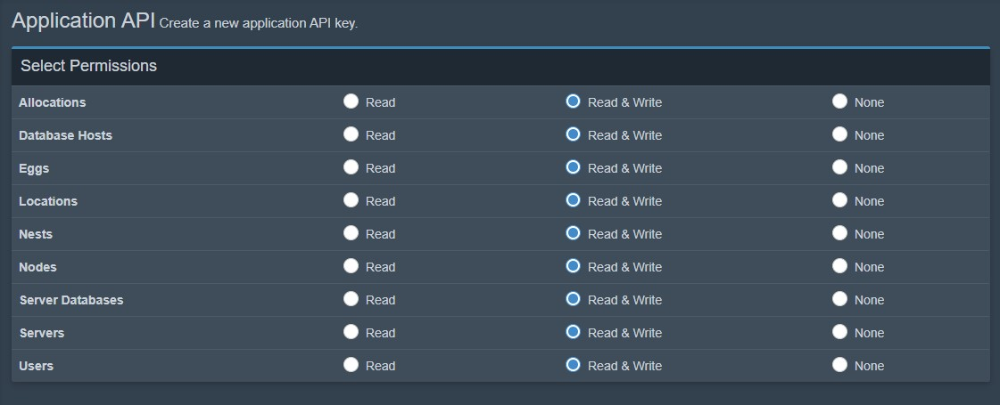

# Settings Configuration


Make sure to follow EXACT instructions, simple things like a Typo CAN and WILL mess up the panel!


## Website Settings


```text
{
  "version": "0.4.0",
  "defaulttheme": "default",
  "website": {
    "port": 80,
    "secret": "change this website session secret password, make sure to change this for your website's security"
}
```

| Setting | Information |
| :--- | :--- |
| version | **Do not change** |
| defaulttheme | Default Theme, set in ~\themes! |
| website.port | Port Astu Panel will run on \(Ex: panel.astuhosting.com:**80**\), 80 is the port! |
| website.secret | Secret Session Password |

## Pterodactyl Panel Settings

```text
"pterodactyl": {
    "domain": "pterodactyl panel domain",
    "key": "pterodactyl panel admin api key with all read and writes"
  },
```

| Setting | Information |
| :--- | :--- |
| domain | Pterodactyl Panel domain, include the https or http! |
| pterodactyl.key | Panel Application Key \(Guide Below\) |

To create your application key go to https://panel.domain.com/admin/api and click `Create New`. Then set these values



### API

```text
"database": "sqlite://database.sqlite",
  "api": {
    "client": {
       "api": {
         "enabled": false,
         "code": "api token here, anyone who has access to this token can ran administrator settings"
       },
```


Anyone with this can run administrator actions.


| Settings | Information |
| :--- | :--- |
| ~.api.enabled | Boolean if the Astu Panel API should be enabled. |
| ~.api.code | Authorization code for the API. |

### Discord Bot


This only makes people join your discord once authorized!


```text
 "bot": {
         "token": "bot token",
         "joinguild": {
           "_comment": "The Discord bot must be in these servers and have invite permissions.",
           "enabled": false,
           "guildid": ["guild id", "another guild id"],
           "forcejoin": false,
           "registeredrole": null
        }
      },
```


First, you must go to [https://discord.com/developers/applications](https://discord.com/developers/applications). Then create a new application, and click bot, then create a bot, copy the token and paste it.


| Setting | Information |
| :--- | :--- |
| ~.bot.token | Token for the Discord Bot |
| ~.bot.joinguild.enabled | If you want to force people to join your guild, select **true.** This does NOT allow banned users! |
| ~.bot.joinguild.guildid | The ID of the guild\(s\) you want users to join |
| ~.bot.joinguild.registeredrole | Role ID for the role you want automatically assigned. **MUST BE SET AS A STRING -&gt; "roleid"**  Set the value to \`NULL\`  |


If you don't have the discord bot in the server, then it will not work!


```text
      "webhook": {
        "_comment": "URL of the webhook to send messages to.",
        "webhook_url": "",
        "auditlogs": {
          "_comment": "This feature allows you to log actions, and get an overview of a users actions (only works if done with dashactyl, not ptero)",
          "enabled": false,
         "_comment2": "The types of notifications disabled. Values: ADMIN, LOGIN, SERVER, COUPONREDEEM",
          "disabled": []
        }
      },
```

<table>
  <thead>
    <tr>
      <th style="text-align:left">Setting</th>
      <th style="text-align:left">Information</th>
    </tr>
  </thead>
  <tbody>
    <tr>
      <td style="text-align:left">~webhook.webook_url</td>
      <td style="text-align:left">WebHook URL to send Audit Logs too</td>
    </tr>
    <tr>
      <td style="text-align:left">~auditlogs.enabled</td>
      <td style="text-align:left">Choose whether or not Audit Logs are enabled!</td>
    </tr>
    <tr>
      <td style="text-align:left">~.auditlogs.disabled</td>
      <td style="text-align:left">
        <p>Disable Certain aspects of the audit log, examples:</p>
        <p>
          <br />[ADMIN, LOGIN, SERVER, COUPONREEDEM]</p>
      </td>
    </tr>
  </tbody>
</table>

### Password Generator

```text
"passwordgenerator": {
        "signup": false,
        "length": 8
},
```

| Setting | Information |
| :--- | :--- |
| ~.passwordgenerator.signup | Self Explanatory... |
| ~.passwordgenerator.length | Length of the Password Generator. |

### Dashboard Settings

```text
"allow": {
        "newusers": true,
        "regen": true,
        "server": {
          "create": true,
          "modify": true,
          "delete": true
        },
        "overresourcessuspend": false,
        "renewsuspendsystem": {
          "_comment": "This feature requires a restart in order to work. Also, this requires every server to start suspended, or else this feature would not work for some servers.",
          "enabled": false,
          "time": 3600
        }
      },
```

| Setting | Information |
| :--- | :--- |
| allow.newusers | Choose whether new users are allowed to signup! |
| allow.regen | Choose whether users can regenerate their password |
| allow.server.create | Choose whether or not users can create new servers |
| allow.server.modify | Choose whether or not users can modify their servers |
| allow.server.delete | Choose whether or not users can delete their servers |
| allow.overresourcessuspend | Choose whether or not users get their servers suspended if the server bypasses the resource limit. |
| allow.server.renewsuspendsystem.true | Choose whether or not users should have renew their server, or it gets suspended. |
| allow.server.renewsuspendsystem.time | Time before the renewal/suspension. |

### OAuth2

```text
"oauth2": {
        "_comment": "Go to https://discord.dev/ and create an application to set these up.",
        "id": "discord oauth2 application id",
        "secret": "discord oauth2 application secret",
        "link": "discord oauth2 application link without the '/callback'",
        "callbackpath": "/callback",
        "prompt": true,

        "ip": {
          "trust x-forwarded-for": true,
          "block": [],

          "_comment": "'duplicate check' is an anti-alt check by IPs.",
          "duplicate check": false,

          "_comment2": "'cookie alt check' is an anti-alt check by cookies.",
          "cookie alt check": true
        }
      },
```


| Setting | Information |
| :--- | :--- |
| oauth2.id | Discord Application ID |
| oauth2.secret | Discord Secret \(DO NOT MIX NUMBERS\) |
| oauth2.link | The AstuPanel URL, must include the `https://` |
| oauth2.callbackpath | Callback Path for OAuth, do not use if you're unsure. |
| oauth2.prompt | Boolean if the user should be prompted to login, even if they're authorized. |
| oauth2.ip.block | IP addresses you want to block from Signing Up/Logging in. |
| oauth2.ip.duplicate check | Boolean if users should **NOT** be allowed to sign up if there's already an account pertaining to that IP. |
| oauth2.ip.cookie alt check | Boolean if users should **NOT** be allowed to sign up if there's already an account saved in their browser, i.e; Checks for existing login cookies. |

### Rate Limits \(fun\)

```text
 "ratelimits": {
        "enabled": true,

        "trust x-forwarded-for": true,

        "requests": 30,
        "per second": 60
      },
```


YOU SHOULD **NOT EVER** TURN RATE LIMITS OFF!


| Setting | Information |
| :--- | :--- |
| ratelimit.enabled | **DO NOT DISABLE THIS! WE ARE NOT LIABLE FOR ANY DAMAGES.** |
| ratelimit.requests | Amount of Requests are **ALLOWED** given the amount allocated in per second settings. |
| ratelimit.per second | How many requests the rate limiters will handle, per second. |

### Packages

```text
      "packages": {
        "default": "default",
        "list": {
          "default": {
            "ram": 1024,
            "disk": 1024,
            "cpu": 100,
            "servers": 1
          }
        }
      },
```

_We're almost done :\)_

| Setting | Information |
| :--- | :--- |
| packages.default | Default Package given to new users |
| packages.list | Object based list of each package |
| packages.list.\[package\].ram | Default RAM given the package |
| packages.list.\[package\].disk | Default Disk Space given the package |
| packages.list.\[package\].cpu | Default CPU usage given the package |
| packages.list.\[package\].servers | Default amount of servers given the package |

### Locations

```text
"locations": {
        "1": {
          "name": "Location Name",

          "_comment": "Make 'package' be null to allow anyone with enough resources in their plan to create a server with this location. Also, make the 'package' variable an array, like [], with the location names with quotes to make a user be required to have a plan in order to use the package.",
          "package": null
        }
      },
```

| Setting | Information |
| :--- | :--- |
|  | ID of the location in Pterodactyl. |
|  | Name of the location shown on the Dashboard |
|  | Should you want everyone to use this location, set it to null, or else make an array of all the packages allowed. \(Ex: \[nyc1, india2, nyc3\]\) |

### Eggs

```text
"eggs": {
        "paper": {
          "display": "Paper",
          "minimum": {
            "ram": 1024,
            "disk": 1024,
            "cpu": 100
          },
          "maximum": {
            "ram": null,
            "disk": null,
            "cpu": null
          },
          "info": {
            "egg": 3,
            "docker_image": "quay.io/pterodactyl/core:java",
            "startup": "java -Xms128M -Xmx{{SERVER_MEMORY}}M -Dterminal.jline=false -Dterminal.ansi=true -jar {{SERVER_JARFILE}}",
            "environment": {
              "SERVER_JARFILE": "server.jar",
              "BUILD_NUMBER": "latest"
            },
            "feature_limits": {
              "databases": 1,
              "backups": 1
            }
          }
        },
```

| Setting | Information |
| :--- | :--- |
| eggs.\[egg\_name\] | Name of the Egg |
| eggs.\[egg\_name\].display | Egg display name, shown on the server creation menu. |
| eggs.\[egg\_name\].minimum | Minimum amount of resources for the server to function |
| eggs.\[egg\_name\].maximum | Maximum amount of resources allowed to be allocated. |
| eggs.\[egg\_name\].info | Get this information from the Pterodactyl API: [Click here](https://dashflo.net/docs/api/pterodactyl/v1/) |

### Coins

```text
coins": {
        "enabled": false,
        "store": {
          "_comment": "The cost and per is not intended to used with 0. This is not intended to sell resources for coins. Make sure coins are enabled too, or else there can be errors.",
          "enabled": false,
          "ram": {
            "cost": 1,
            "per": 1
          },
          "disk": {
            "cost": 1,
            "per": 1
          },
          "cpu": {
            "cost": 1,
            "per": 1
          },
          "servers": {
            "cost": 1,
            "per": 1
          }
        }
      }
    },
```

| Setting | Information |
| :--- | :--- |
| coins.enabled | Boolean that decides whether or not the coin system should be enabled. |
| coins.store.enabled | Boolean that decides whether or not the store should be enabled. |
| coins.store.\[resource\].cost | The cost of a resource, in coins. |
| coins.store.\[resource\].per | The amount of a resource received when bought. |

### Arc.io \(OPTIONAL\)

This step is **optional**, it allows you to make money using [arc.io](https://arc.io/), learn more at their [website](https://arc.io/).

This step requires an account from [https://arc.io](https://arc.io/).

```text
 "arcio": {
      "_comment": "You can make an arc.io widget on https://arc.io. You can get money using arc.io.",
      "enabled": false,
      "widgetid": "arc.io widget id here"


"afk page": {
          "_comment": "This will not effect any current arc.io sessions, and will require a restart to kick everyone out of the websocket sesison.",
          "_comment2": "Make sure coins are enabled if you choose to enable this option!",
          "enabled": false,

          "_comment3": "If you change the path, you need to restart for it to take full effect.",
          "path": "afkwspath",

          "_comment4": "This afk page will give the users [coins variable] coins every [every variable] seconds.",
          "every": 60,

          "_comment5": "The coins variable is meant to not be under 1. There may be bugs if the coins variable is less than 1.",
          "coins": 1
        }
    }
  }
}
```

| Setting | Information |
| :--- | :--- |
| arcio.enabled | Boolean whether or not the arc.io widget should be enabled |
| arcio.widgetid | Widget ID from Arc.io |
| arcio.afkpage.enabled | Boolean whether or not the AFK page is enabled |
| arcio.afkpage.path | AFK page path, if you don't know what this is, you can ignore it |
| arcio.afkpage.every | Amount of seconds to recieve coins |
| arcio.afkpage.coin | Coins given while AFKing |

